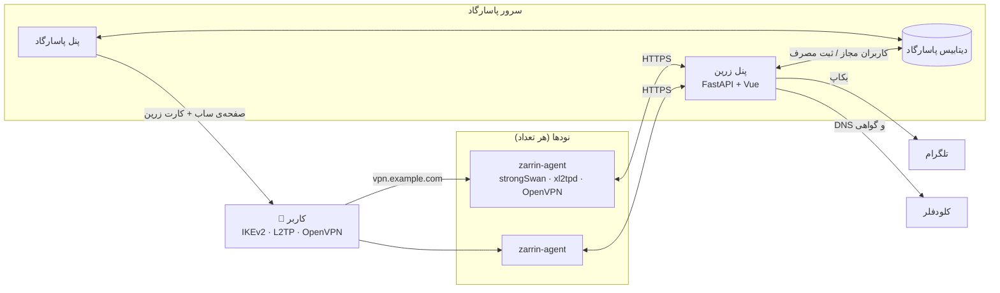

<div align="center">


# زرین · Zarrin

**پنل تکمیلی [PasarGuard](https://github.com/PasarGuard/panel)**<br>
همان کاربرهای پاسارگاد، با **IKEv2**، **L2TP/IPsec** و **OpenVPN** — بدون دست زدن به خود پاسارگاد

<br>


<br>

[شروع سریع](#شروع-سریع) ·
[نصب پنل](#نصب-پنل) ·
[نودها](#نودها) ·
[راهنمای کاربران](#راهنمای-اتصال-کاربران) ·
[بکاپ](#بکاپ-و-ریستور) ·
[دستورها](#دستورهای-خط-فرمان) ·
[عیب‌یابی](#عیب‌یابی)

</div>

<br>

## فهرست

- [زرین چیست؟](#زرین-چیست)
- [امکانات](#امکانات)
- [وضعیت پروتکل‌ها روی اینترنت ایران](#وضعیت-پروتکل‌ها-روی-اینترنت-ایران)
- [معماری](#معماری)
- [شروع سریع](#شروع-سریع)
- [پیش‌نیازها](#پیش‌نیازها)
- [نصب پنل](#نصب-پنل)
- [راه‌اندازی اولیه در پنل](#راه‌اندازی-اولیه-در-پنل)
- [نودها](#نودها)
- [کاربران و رمز عبور](#کاربران-و-رمز-عبور)
- [صفحه‌ی ساب](#صفحه‌ی-ساب)
- [راهنمای اتصال کاربران](#راهنمای-اتصال-کاربران)
- [کاربران آنلاین](#کاربران-آنلاین)
- [بکاپ و ریستور](#بکاپ-و-ریستور)
- [آپدیت](#آپدیت)
- [دستورهای خط فرمان](#دستورهای-خط-فرمان)
- [پورت‌ها و فایروال](#پورت‌ها-و-فایروال)
- [امنیت](#امنیت)
- [عیب‌یابی](#عیب‌یابی)
- [حذف کامل](#حذف-کامل)
- [ساختار پروژه و توسعه](#ساختار-پروژه-و-توسعه)
- [نقشه‌ی راه](#نقشه‌ی-راه)

<br>

## زرین چیست؟

پاسارگاد فقط پروتکل‌های Xray را می‌دهد. زرین کنار پاسارگاد نصب می‌شود و به **همان کاربرها** اجازه می‌دهد با پروتکل‌های کلاسیک هم وصل شوند؛ پروتکل‌هایی که اغلب بدون نصب برنامه، با خود گوشی و ویندوز کار می‌کنند.

- **کاربر جدیدی ساخته نمی‌شود.** هر کاربری که در پاسارگاد فعال است، در زرین هم فعال است؛ با همان یوزرنیم، همان تاریخ انقضا و همان حجم.
- **مصرف یکجا حساب می‌شود.** ترافیک IKEv2، L2TP و OpenVPN به حجم مصرفی کاربر در پاسارگاد اضافه می‌شود؛ زیر همان نود و با ضریب همان نود.
- **آپدیت‌پذیر.** زرین در پوشه‌ها و کانتینرهای خودش است (`/opt/zarrin` روی پنل و `/opt/zarrin-agent` روی نودها). آپدیت پاسارگاد چیزی از زرین پاک نمی‌کند و آپدیت زرین هم به پاسارگاد دست نمی‌زند.

<br>

## امکانات

<table dir="rtl">
<tr>
<td width="50%" valign="top">

### 🔌 پروتکل‌ها
- پروتکل **IKEv2** با گواهی معتبر Let's Encrypt (بدون نصب CA) و پروفایل یک‌لمسی آیفون و مک
- **L2TP/IPsec** با کلید مشترک (PSK) برای ویندوز، آیفون و مک
- **OpenVPN** روی UDP و TCP، با پورت‌های جایگزین و «فایل خودکار» که خودش راه باز را پیدا می‌کند
- روشن و خاموش کردن هر پروتکل برای هر نود

</td>
<td width="50%" valign="top">

### 👥 کاربران
- کاربرها فقط در پاسارگاد ساخته می‌شوند
- رمز ۶ رقمی ثابت برای هر کاربر (با revoke عوض می‌شود)
- کاربر جدید ظرف چند ثانیه می‌تواند وصل شود
- کاربر منقضی، تمام‌حجم یا غیرفعال فوراً قطع می‌شود
- کارت اتصال آماده در صفحه‌ی ساب

</td>
</tr>
<tr>
<td valign="top">

### 🖥️ نودها
- اضافه کردن نود با **یک دستور** که پنل می‌سازد
- نصب کنار نود پاسارگاد، بدون تداخل
- آپدیت و جابه‌جایی نود با دستور «نصب مجدد»
- وضعیت، نسخه و تعداد آنلاین هر نود

</td>
<td valign="top">

### 🛡️ مدیریت و امنیت
- پنل وب فارسی، تم روشن و تیره
- ورود با رمز + کد دومرحله‌ای (TOTP)
- کاربران آنلاین همه‌ی نودها، قطع و مسدود کردن موقت
- گزارش همه‌ی کارهای ادمین‌ها
- بکاپ خودکار به تلگرام و ریستور کامل از داخل پنل

</td>
</tr>
</table>

<br>

## وضعیت پروتکل‌ها روی اینترنت ایران

آخرین تست‌ها (مهر ۱۴۰۵). وضعیت فیلترینگ مدام عوض می‌شود.

<div dir="rtl">

| پروتکل | برنامه‌ی لازم | مخابرات | همراه اول | ایرانسل |
|---|---|:-:|:-:|:-:|
| IKEv2 | ندارد (داخل سیستم‌عامل) | — | ✅ | — |
| L2TP/IPsec | ندارد (داخل سیستم‌عامل) | ✅ | — | — |
| OpenVPN UDP | OpenVPN Connect | ❌ | ✅ | ✅ |
| OpenVPN TCP | OpenVPN Connect | ❌ | ⚠️ وصل می‌شود ولی ترافیک ندارد | ✅ |

</div>

✅ کار می‌کند · ❌ وصل نمی‌شود · ⚠️ مشکل دارد · — هنوز تست نشده

> [!NOTE]
> روی مخابرات، فیلتر خود الگوی OpenVPN را تشخیص می‌دهد و با عوض کردن پورت درست نمی‌شود. کاربرهای مخابرات از L2TP یا IKEv2 استفاده کنند.

<br>

## معماری

<div dir="ltr">



</div>

- **پنل زرین** روی همان سرور پاسارگاد اجرا می‌شود. کاربرهای مجاز را از دیتابیس پاسارگاد می‌خواند و مصرف را در آن ثبت می‌کند؛ با یک نقش دیتابیس جداگانه (`zarrin`) که فقط به همین ستون‌ها دسترسی دارد.
- **ایجنت زرین** روی هر نود، در یک کانتینر Docker با شبکه‌ی host، سرویس‌های VPN را اجرا می‌کند. نود به GitHub نیازی ندارد و همه‌چیز را از پنل می‌گیرد.
- همه‌ی نودها پشت **یک دامنه‌ی مشترک** هستند (مثلاً `vpn.example.com` با چند رکورد A). کاربر یک آدرس دارد و به هر نودی که DNS بدهد وصل می‌شود.

**چرخه‌ی کار:**

<div dir="rtl">

| هر | کار |
|---|---|
| ۵ ثانیه | ایجنت فهرست کاربرهای مجاز را از پنل می‌گیرد (فقط اگر عوض شده باشد) |
| ۱۰ ثانیه | ایجنت جلسه‌ها و شمارنده‌های ترافیک را می‌خواند |
| ۱۵ ثانیه | ایجنت مصرف و کاربرهای آنلاین را گزارش می‌دهد و پنل مصرف را در پاسارگاد ثبت می‌کند |
| ۳۰ ثانیه | ایجنت تنظیمات را می‌گیرد و سرویس‌ها را با پنل هماهنگ می‌کند |

</div>

هر گزارش مصرف شناسه‌ی یکتا دارد، پس اگر ارتباط قطع و وصل شود، مصرف دوبار حساب نمی‌شود. مصرف جلسه‌هایی که بین دو گزارش تمام می‌شوند هم با شمارنده‌های نهایی‌شان ثبت می‌شود.

<br>

## شروع سریع

۱. روی سرور پاسارگاد، ریپو را بگیرید و نصب‌کننده را اجرا کنید:

<div dir="ltr">

```bash
git clone git@github.com:mmdrzh/zarrin.git /opt/zarrin && /opt/zarrin/install.sh
```

</div>

۲. وارد پنل شوید، کد دومرحله‌ای را فعال کنید و در **تنظیمات** دامنه‌ی VPN، توکن کلودفلر و ربات تلگرام را وارد کنید.

۳. در **نودها ← افزودن نود** دستور نصب را بگیرید و روی سرور نود اجرا کنید:

<div dir="ltr">

```bash
curl -fsSL https://zarrin.example.com:PORT/join/TOKEN | sudo bash
```

</div>

۴. در DNS، IP نود را به رکورد دامنه‌ی VPN اضافه کنید و کارت صفحه‌ی ساب را از **تنظیمات** به‌روز کنید. تمام!

جزئیات هر مرحله در ادامه آمده است.

<br>

## پیش‌نیازها

**سرور پنل** (همان سرور پاسارگاد):
- پاسارگاد نصب‌شده در `/opt/pasarguard` با دیتابیس **PostgreSQL یا TimescaleDB** (پاسارگاد با SQLite یا MySQL پشتیبانی نمی‌شود)
- دیتابیس پاسارگاد روی `127.0.0.1` منتشر شده باشد (پیش‌فرض نصب پاسارگاد)
- Docker و Docker Compose (پاسارگاد خودش نصب کرده است)
- یک ساب‌دامین برای پنل زرین که به IP همین سرور اشاره کند (در کلودفلر: **ابر خاکستری / DNS only**)
- یک پورت آزاد برای پنل. پورت‌هایی که کلودفلر پروکسی می‌کند (مثل 443، 2053، 2083، 2087، 2096، 8443) را برای اینباندها نگه دارید؛ نصب‌کننده یک پورت تصادفی پیشنهاد می‌دهد.

**سرور نود:**
- اوبونتو ۲۲.۰۴ یا ۲۴.۰۴ با دسترسی root
- اگر Docker نصب نیست، نصب‌کننده‌ی نود خودش نصبش می‌کند
- می‌تواند کنار نود پاسارگاد باشد؛ فقط پورت‌های بخش [پورت‌ها](#پورت‌ها-و-فایروال) نباید دست اینباندها باشد

**دامنه‌ی VPN:** یک ساب‌دامین (مثلاً `vpn.example.com`) که به IP همه‌ی نودها اشاره کند، در کلودفلر با **ابر خاکستری**. گواهی IKEv2 برای همین نام صادر می‌شود.

<br>

## نصب پنل

### ۱. دسترسی سرور به ریپو

ریپو خصوصی است. ساده‌ترین راه، یک **Deploy key** فقط‌خواندنی است. روی سرور پنل:

<div dir="ltr">

```bash
sudo ssh-keygen -t ed25519 -N "" -f /root/.ssh/zarrin_deploy -C zarrin-deploy
```

```bash
sudo cat /root/.ssh/zarrin_deploy.pub
```

```bash
printf 'Host github.com\n  IdentityFile /root/.ssh/zarrin_deploy\n' | sudo tee -a /root/.ssh/config
```

</div>

خروجی دستور دوم را در GitHub در **Settings ← Deploy keys ← Add deploy key** اضافه کنید (تیک Allow write access را **نزنید**).

<details dir="rtl">
<summary>راه دوم: توکن به‌جای Deploy key</summary>

<br>

در GitHub یک **Fine-grained personal access token** فقط برای همین ریپو با دسترسی **Contents: Read-only** بسازید و این‌طور کلون کنید:

<div dir="ltr">

```bash
sudo git clone https://TOKEN@github.com/mmdrzh/zarrin.git /opt/zarrin
```

</div>
</details>

### ۲. نصب

<div dir="ltr">

```bash
sudo git clone git@github.com:mmdrzh/zarrin.git /opt/zarrin
```

```bash
sudo /opt/zarrin/install.sh
```

</div>

نصب‌کننده این‌ها را می‌پرسد:

<div dir="rtl">

| سؤال | توضیح |
|---|---|
| Panel domain | ساب‌دامین پنل زرین، مثلاً `zarrin.example.com` |
| Panel port | پورت پنل (پیش‌فرض: یک پورت تصادفی) |
| E-mail for Let's Encrypt | اختیاری |
| Admin username | نام ادمین اول؛ رمزش در پایان نصب نمایش داده می‌شود |

</div>

<details dir="rtl">
<summary>نصب بدون سؤال (برای اسکریپت)</summary>

<br>

همه‌ی جواب‌ها را می‌شود با متغیر محیطی داد. اگر پاسارگاد جای دیگری نصب است، `PASARGUARD_HOST_DIR` را هم بدهید.

<div dir="ltr">

```bash
sudo ZARRIN_DOMAIN=zarrin.example.com ZARRIN_PORT=56246 ZARRIN_ADMIN=admin ACME_EMAIL=you@example.com /opt/zarrin/install.sh
```

</div>
</details>

**نصب‌کننده چه می‌کند؟**
- تنظیمات دیتابیس، مسیر ساب و SSL را از `/opt/pasarguard/.env` می‌خواند
- نقش دیتابیس `zarrin` را با کمترین دسترسی لازم می‌سازد
- کانتینر `zarrin` را می‌سازد و اجرا می‌کند (شبکه‌ی host)
- دستور `zarrin` را در `/usr/local/bin` و سرویس‌های systemd برای ریستور و کارت ساب را نصب می‌کند
- ادمین اول را می‌سازد
- اگر از نسخه‌ی قدیمی pg-ikev2 مهاجرت می‌کنید، اطلاعاتش را منتقل می‌کند

در پایان، پورت پنل را در فایروال سرور باز کنید و به `https://zarrin.example.com:PORT` بروید. تا وقتی گواهی معتبر صادر نشده، پنل با یک گواهی موقت (خودامضا) بالا می‌آید.

<br>

## راه‌اندازی اولیه در پنل

به همین ترتیب جلو بروید:

<div dir="rtl">

| | کجا | چه کاری |
|:-:|---|---|
| ۱ | **امنیت** | رمز را عوض کنید و **کد دومرحله‌ای** را با Google Authenticator یا هر برنامه‌ی TOTP فعال کنید |
| ۲ | **تنظیمات ← کلودفلر** | برای هر حساب کلودفلر یک API Token با قالب **Edit zone DNS** بسازید و اضافه کنید. زرین برای هر دامنه خودش توکن درست را پیدا می‌کند |
| ۳ | **تنظیمات ← کلودفلر** | **صدور / تمدید گواهی** پنل (اول با DNS کلودفلر، اگر نشد با HTTP روی پورت 80) |
| ۴ | **تنظیمات ← اتصال کاربران** | دامنه‌ی VPN (مثلاً `vpn.example.com`) و DNS کاربران (پیش‌فرض `8.8.8.8,1.1.1.1`) |
| ۵ | **تنظیمات ← ربات تلگرام** | توکن ربات (از [@BotFather](https://t.me/BotFather))، Chat ID، و فاصله‌ی بکاپ؛ با دکمه‌ی تست بررسی کنید |
| ۶ | **تنظیمات ← پاسارگاد** | API Key پاسارگاد (`pg_key_...`) که در پنل پاسارگاد با ادمین sudo می‌سازید؛ با دکمه‌ی تست بررسی کنید |
| ۷ | **نودها** | نودها را اضافه کنید ([بخش نودها](#نودها)) |
| ۸ | **تنظیمات** | **به‌روزرسانی کارت صفحه‌ی ساب** |

</div>

> [!IMPORTANT]
> فقط **API Token** با دسترسی محدود بدهید. زرین Global API Key کلودفلر را قبول نمی‌کند، چون دسترسی کامل به کل حساب دارد.

> [!TIP]
> برای پیدا کردن Chat ID خودتان، به ربات [@userinfobot](https://t.me/userinfobot) پیام بدهید. اگر بکاپ را در کانال می‌خواهید، ربات را ادمین کانال کنید و آیدی عددی کانال (با `-100` شروع می‌شود) را بدهید. اگر سرور به تلگرام دسترسی ندارد، در همان بخش یک پراکسی (مثلاً `socks5://127.0.0.1:1080`) بدهید.

**بقیه‌ی تنظیمات «اتصال کاربران»:**

<div dir="rtl">

| تنظیم | پیش‌فرض | توضیح |
|---|---|---|
| کلید مشترک L2TP | تصادفی | برای همه‌ی کاربران و نودها یکی است. با عوض کردنش، همه‌ی کاربران L2TP باید کلید را در دستگاهشان عوض کنند |
| پورت OpenVPN UDP | `1194` | `0` یعنی خاموش |
| پورت OpenVPN TCP | `443` | `0` یعنی خاموش. اگر اینباند پاسارگاد روی نودها از TCP 443 استفاده می‌کند، این را عوض کنید |
| پورت‌های جایگزین UDP | `443,2408` | به پورت اصلی UDP هدایت می‌شوند |
| پورت‌های جایگزین TCP | `2053,2087` | به پورت اصلی TCP هدایت می‌شوند |

</div>

پورت‌های جایگزین سرویس جدیدی اجرا نمی‌کنند؛ فایروال نود آن‌ها را به پورت اصلی می‌فرستد. اگر روی نودی پورتی دست برنامه‌ی دیگری باشد (مثلاً اینباند پاسارگاد)، ایجنت آن پورت را کنار می‌گذارد و چیزی را خراب نمی‌کند. با تغییر دامنه، کلید L2TP یا پورت‌ها، کارت صفحه‌ی ساب خودکار به‌روز می‌شود.

<br>

## نودها

### افزودن نود

۱. در پنل: **نودها ← + افزودن نود**، یک نام بدهید و **ساخت دستور نصب** را بزنید.

۲. دستور را روی سرور نود با root اجرا کنید (دستور تا ۲۴ ساعت معتبر است):

<div dir="ltr">

```bash
curl -fsSL https://zarrin.example.com:PORT/join/TOKEN | sudo bash
```

</div>

۳. در DNS، IP نود را به رکورد A دامنه‌ی VPN اضافه کنید (ابر خاکستری).

۴. در صفحه‌ی **نودها** پروتکل‌هایی را که می‌خواهید برای این نود روشن کنید.

**دستور نصب نود چه می‌کند؟**
- اگر لازم باشد Docker را نصب می‌کند
- IP forwarding را روشن می‌کند و پورت‌های سرویس‌ها را از بازه‌ی پورت‌های موقت سیستم کنار می‌گذارد (تا Xray آن‌ها را نگیرد)
- ماژول‌های لازم کرنل (ppp، tun، xt_policy) را بار می‌کند
- ایجنت را از خود پنل دانلود و در `/opt/zarrin-agent` نصب می‌کند
- اول ایمیج جدید را می‌سازد و بعد جای قبلی را می‌گیرد، پس قطعی در حد چند ثانیه است
- گواهی Let's Encrypt دامنه‌ی VPN را روی پورت 80 می‌گیرد. چون دامنه به همه‌ی نودها اشاره می‌کند، نودها چالش‌های Let's Encrypt را برای هم جواب می‌دهند

### جدول نودها

<div dir="rtl">

| ستون | توضیح |
|---|---|
| وضعیت | آنلاین یا آفلاین بودن ایجنت (آخرین ارتباط) |
| آنلاین | تعداد کاربرهای وصل روی این نود |
| نود پاسارگاد | مصرف این نود زیر کدام نود پاسارگاد ثبت شود (با ضریب همان نود). اگر IP یکی باشد، خودکار پیدا می‌شود |
| IKEv2 / L2TP / OpenVPN | روشن و خاموش کردن هر پروتکل برای این نود |
| ایجنت | نسخه‌ی ایجنت |

</div>

### جابه‌جایی یا عوض کردن نود

وقتی سرور نودی عوض می‌شود:

۱. نود جدید را مثل بالا اضافه کنید و IP آن را به DNS دامنه‌ی VPN بدهید.

۲. در DNS، IP نود قدیمی را بردارید.

۳. نود قدیمی را در پنل **حذف** کنید.

برای نصب دوباره روی همان سرور (مثلاً بعد از ریست سرور یا برای آپدیت ایجنت)، در جدول نودها **نصب مجدد** را بزنید و دستور جدید را روی همان سرور اجرا کنید. تنظیمات و گواهی‌های نود حفظ می‌شود.

<br>

## کاربران و رمز عبور

کاربرها **فقط در پاسارگاد** ساخته، تمدید و حذف می‌شوند. زرین کاربری را مجاز می‌داند که:
- وضعیتش در پاسارگاد `active` یا `on_hold` باشد
- تاریخ انقضایش نگذشته باشد
- حجمش تمام نشده باشد

- **نام کاربری:** همان یوزرنیم پاسارگاد
- **رمز:** یک عدد ۶ رقمی که از UUID کاربر ساخته می‌شود

اگر لینک ساب کاربر را در پاسارگاد **revoke** کنید، UUID و در نتیجه رمز ۶ رقمی عوض می‌شود و جلسه‌های فعال کاربر قطع می‌شوند. کاربری که منقضی، تمام‌حجم یا غیرفعال شود، ظرف چند ثانیه از همه‌ی نودها قطع می‌شود.

در صفحه‌ی **کاربران** پنل زرین می‌توانید یوزر را جستجو کنید و رمز و اطلاعات اتصالش (سرور، کلید L2TP و فایل‌های OpenVPN) را ببینید.

<details dir="rtl">
<summary>رمز ۶ رقمی دقیقاً چطور ساخته می‌شود؟</summary>

<br>

شناسه‌ی UUID کاربر (`proxy_settings.vless.id`) بدون خط تیره و با حروف کوچک، ۳۲ کاراکتر هگز است. رقم iام رمز (i از ۰ تا ۵) برابر است با باقی‌مانده‌ی تقسیم عدد هگز کاراکترهای `5i` تا `5i+5` بر ۱۰. همین محاسبه در قالب صفحه‌ی ساب (Jinja) و در پنل زرین انجام می‌شود.

<div dir="ltr">

```python
h = uuid.replace("-", "").lower()
password = "".join(str(int(h[i*5:i*5+5], 16) % 10) for i in range(6))
```

</div>
</details>

<br>

## صفحه‌ی ساب

زرین یک **کارت اتصال** به قالب صفحه‌ی ساب پاسارگاد اضافه می‌کند. هر کاربر در صفحه‌ی ساب خودش این‌ها را می‌بیند:

- بخش **IKEv2:** سرور، نام کاربری و رمز با دکمه‌ی کپی، نصب یک‌لمسی پروفایل برای آیفون، آیپد و مک، و راهنمای تنظیم دستی آیفون، اندروید و ویندوز
- بخش **L2TP/IPsec:** سرور، کلید، نام کاربری و رمز، و راهنمای ویندوز، آیفون و مک (با رفع خطای 809 ویندوز)
- بخش **OpenVPN:** دانلود «فایل خودکار» (پیشنهادی)، فایل فقط UDP و فایل فقط TCP، با لینک نصب OpenVPN Connect

کارت در قالب ساب پاسارگاد (`/var/lib/pasarguard/templates/subscription/index.html`) قرار می‌گیرد و رمز هر کاربر همان‌جا با Jinja محاسبه می‌شود؛ پس صفحه‌ی ساب به پنل زرین وابسته نیست. قبل از هر تغییر، از قالب بکاپ گرفته می‌شود (۵ نسخه‌ی آخر نگه داشته می‌شود) و قالب پاسارگاد بعد از تغییر تست می‌شود.

<div dir="rtl">

| کار | کجا |
|---|---|
| اضافه یا به‌روز کردن کارت | پنل: **تنظیمات ← به‌روزرسانی کارت صفحه‌ی ساب**، یا دستور `zarrin subpage` |
| حذف کارت | `zarrin subpage --remove` |

</div>

<br>

## راهنمای اتصال کاربران

همه‌ی این اطلاعات با مقادیر واقعی هر کاربر، در کارت صفحه‌ی ساب هست. این بخش برای پشتیبانی است.

### اتصال با IKEv2

<table dir="rtl">
<tr><th>دستگاه</th><th>تنظیمات</th></tr>
<tr><td><b>آیفون، آیپد، مک</b></td><td>در صفحه‌ی ساب، دکمه‌ی <b>نصب</b> را بزنید و پروفایل را نصب کنید. یا دستی: <code>Settings › General › VPN › Add VPN Configuration</code> · Type: <code>IKEv2</code> · Server و Remote ID: دامنه‌ی VPN · User Authentication: <code>Username</code></td></tr>
<tr><td><b>اندروید ۱۱ به بعد</b></td><td><code>Settings › Network › VPN</code> · Type: <code>IKEv2/IPSec MSCHAPv2</code> · Server و IPSec identifier: دامنه‌ی VPN · CA certificate: <code>System</code></td></tr>
<tr><td><b>ویندوز ۱۰ و ۱۱</b></td><td><code>Settings › Network &amp; internet › VPN › Add VPN</code> · VPN type: <code>IKEv2</code> · Sign-in info: <code>User name and password</code></td></tr>
</table>

### اتصال با L2TP/IPsec

<table dir="rtl">
<tr><th>دستگاه</th><th>تنظیمات</th></tr>
<tr><td><b>ویندوز</b></td><td><code>Settings › Network &amp; internet › VPN › Add VPN</code> · VPN type: <code>L2TP/IPsec with pre-shared key</code> · Pre-shared key: کلید L2TP · Sign-in info: <code>User name and password</code></td></tr>
<tr><td><b>آیفون</b></td><td><code>Settings › General › VPN › Add VPN Configuration</code> · Type: <code>L2TP</code> · Account و Password · Secret: کلید L2TP · Send All Traffic: روشن</td></tr>
<tr><td><b>مک</b></td><td><code>System Settings › VPN › Add VPN Configuration › L2TP over IPSec</code> · Shared secret: کلید L2TP · Options › Send all traffic over VPN: روشن</td></tr>
</table>

اگر ویندوز با **خطای 809** وصل نشد، این دستور را در CMD با **Run as administrator** بزنید و ویندوز را ری‌استارت کنید:

<div dir="ltr">

```bat
reg add HKLM\SYSTEM\CurrentControlSet\Services\PolicyAgent /v AssumeUDPEncapsulationContextOnSendRule /t REG_DWORD /d 2 /f
```

</div>

### اتصال با OpenVPN

۱. برنامه‌ی **OpenVPN Connect** را نصب کنید ([آیفون](https://apps.apple.com/app/openvpn-connect/id590379981) · [اندروید](https://play.google.com/store/apps/details?id=net.openvpn.openvpn) · [ویندوز و مک](https://openvpn.net/client/)).

۲. **فایل خودکار** را از صفحه‌ی ساب دانلود و در برنامه Import کنید (آیفون: بعد از دانلود، Share ← OpenVPN).

۳. نام کاربری و رمز را وارد کنید و Connect بزنید.

<div dir="rtl">

| فایل | چه می‌کند |
|---|---|
| **خودکار** (پیشنهادی) | اول همه‌ی پورت‌های UDP، بعد همه‌ی پورت‌های TCP را امتحان می‌کند (هر کدام حدود ۵ ثانیه) |
| فقط UDP | سریع‌تر؛ پورت اصلی و جایگزین‌های UDP |
| فقط TCP | برای شبکه‌هایی که UDP را می‌بندند |

</div>

فایل OpenVPN برای همه‌ی کاربرها یکی است؛ ورود فقط با نام کاربری و رمز است و گواهی کاربر لازم نیست.

<br>

## کاربران آنلاین

صفحه‌ی **آنلاین** همه‌ی جلسه‌های فعال همه‌ی نودها را نشان می‌دهد: کاربر، پروتکل، نود، IP کاربر، مدت اتصال، آپلود و دانلود.

- **قطع:** جلسه‌های کاربر را قطع می‌کند (کاربر می‌تواند دوباره وصل شود)
- **قطع و مسدود:** کاربر را قطع و برای مدت مشخصی در زرین مسدود می‌کند (فقط IKEv2، L2TP و OpenVPN؛ به پاسارگاد دست نمی‌زند)
- فهرست **مسدودهای موقت** با زمان پایان مسدودی هر کاربر

<br>

## بکاپ و ریستور

### چه چیزهایی در بکاپ است؟

هر بکاپ یک فایل `.tar.gz` است شامل:

<div dir="rtl">

| بخش | محتوا |
|---|---|
| دیتابیس پاسارگاد | کل دیتابیس (کاربرها، ادمین‌ها، نودها، اینباندها، هاست‌ها، ...) |
| فایل‌های پاسارگاد | گواهی‌های SSL و قالب‌ها (از جمله صفحه‌ی ساب) |
| تنظیمات پاسارگاد | فایل `.env` |
| زرین | ادمین‌ها، نودها و تنظیمات زرین |

</div>

نسخه‌ی PostgreSQL و TimescaleDB هم در بکاپ ثبت می‌شود تا ریستور روی سرور تازه هم همان نسخه را بسازد.

### بکاپ خودکار

در **تنظیمات ← ربات تلگرام** فاصله‌ی بکاپ را (به ساعت) تعیین کنید. هر بکاپ به تلگرام فرستاده می‌شود؛ اگر بزرگ‌تر از حد مجاز تلگرام باشد، در چند تکه‌ی `.part01`، `.part02` و ... . تعدادی از بکاپ‌های آخر هم روی خود سرور نگه داشته می‌شود. در صفحه‌ی **بکاپ‌ها** می‌توانید دستی هم بکاپ بگیرید، دانلود یا حذف کنید.

### ریستور

در صفحه‌ی **بکاپ‌ها**، یکی از بکاپ‌های سرور را انتخاب کنید یا فایل را آپلود کنید (اگر تکه‌تکه است، همه‌ی تکه‌ها را با هم انتخاب کنید). بعد مشخص کنید چه چیزهایی برگردد:

- ☑️ دیتابیس پاسارگاد
- ☑️ فایل‌های پاسارگاد (گواهی‌ها و قالب صفحه‌ی ساب)
- ☑️ اطلاعات زرین
- ☑️ تنظیمات `.env` پاسارگاد، **به‌جز** تنظیمات دیتابیس

برای تأیید `RESTORE` را بنویسید. ریستور روی خود سرور (بیرون از کانتینر) اجرا می‌شود و وضعیتش در همان صفحه نمایش داده می‌شود. پاسارگاد چند لحظه پایین می‌آید.

> [!NOTE]
> ریستور دیتابیس فعلی را پاک نمی‌کند: اول از آن بکاپ می‌گیرد و بعد آن را با نام `<db>_before_restore_<زمان>` کنار می‌گذارد. اگر چیزی اشتباه شد، دیتابیس قبلی هنوز هست.

### انتقال همه‌چیز به سرور جدید

۱. روی سرور جدید پاسارگاد را با دیتابیس TimescaleDB نصب کنید.

۲. زرین را [نصب کنید](#نصب-پنل).

۳. در پنل زرین، آخرین بکاپ را آپلود و با هر چهار گزینه ریستور کنید.

۴. رکورد DNS دامنه‌ی پنل‌ها را به IP جدید عوض کنید.

این روند روی یک سرور تازه تست شده است: همه‌ی جدول‌ها و صفحه‌ی ساب دقیقاً مثل سرور اصلی برگشتند.

<br>

## آپدیت

<div dir="rtl">

| چه چیزی | چطور |
|---|---|
| **پنل زرین** | `zarrin update`: آخرین نسخه را از GitHub می‌گیرد، می‌سازد و اجرا می‌کند. پاسارگاد دست نمی‌خورد |
| **ایجنت نودها** | در صفحه‌ی نودها **نصب مجدد** را بزنید و دستور را روی همان نود اجرا کنید |
| **پاسارگاد** | مثل همیشه. زرین تحت تأثیر قرار نمی‌گیرد؛ اگر کارت صفحه‌ی ساب نبود، `zarrin subpage` را بزنید |

</div>

<br>

## دستورهای خط فرمان

### روی سرور پنل

<div dir="rtl">

| دستور | کار |
|---|---|
| `zarrin status` | وضعیت کانتینر و آدرس پنل |
| `zarrin logs [N]` | N خط آخر لاگ (پیش‌فرض ۱۰۰) و دنبال کردن لاگ |
| `zarrin restart` | ری‌استارت پنل |
| `zarrin update` | آپدیت از GitHub |
| `zarrin admin <user>` | ساخت ادمین یا ریست رمز ادمین (کد دومرحله‌ای‌اش خاموش می‌شود) |
| `zarrin subpage` | اضافه یا به‌روز کردن کارت صفحه‌ی ساب |
| `zarrin subpage --remove` | حذف کارت از صفحه‌ی ساب |

</div>

### روی نود

<div dir="rtl">

| دستور | کار |
|---|---|
| `docker logs -f zarrin-agent` | لاگ ایجنت |
| `docker exec zarrin-agent swanctl --list-sas` | اتصال‌های IKEv2 و L2TP |
| `cd /opt/zarrin-agent && docker compose restart` | ری‌استارت ایجنت |

</div>

<br>

## پورت‌ها و فایروال

<div dir="rtl">

| سرور | پروتکل و پورت | برای |
|---|---|---|
| پنل | TCP پورت زرین | پنل مدیریت و ارتباط نودها |
| پنل | TCP 80 | گرفتن و تمدید گواهی پنل (فقط وقتی DNS کلودفلر در دسترس نیست) |
| پنل | TCP 62060 | فقط برای سازگاری با نصب قدیمی pg-ikev2 و اپ Tifusi |
| نود | UDP 500، 4500 | IKEv2 و L2TP/IPsec |
| نود | UDP 1194، TCP 443 | OpenVPN (پورت‌های اصلی، قابل تغییر) |
| نود | UDP 443، 2408 · TCP 2053، 2087 | OpenVPN (پورت‌های جایگزین، قابل تغییر) |
| نود | TCP 80 | گرفتن و تمدید گواهی IKEv2 |

</div>

> [!WARNING]
> پورت UDP 1701 (L2TP) را باز **نکنید**. ایجنت فقط ترافیکی را روی این پورت قبول می‌کند که از داخل IPsec بیاید.

ایجنت قوانین فایروال خودش را در زنجیره‌های جداگانه‌ی iptables (`ZARRIN-*`) می‌سازد و با خاموش شدن پاکشان می‌کند؛ به قوانین دیگر سرور دست نمی‌زند.

<br>

## امنیت

**پنل**
- رمز ادمین‌ها با argon2 ذخیره می‌شود؛ کد دومرحله‌ای (TOTP) برای هر ادمین
- نشست با کوکی امن و محافظت در برابر CSRF
- همه‌ی کارهای ادمین‌ها با IP در **گزارش فعالیت** ثبت می‌شود
- کانتینر پنل به Docker دسترسی ندارد و بیشتر قابلیت‌های root از آن گرفته شده است. کارهایی که دسترسی بالا لازم دارند (ریستور و کارت ساب) را سرویس‌های systemd روی خود سرور انجام می‌دهند
- دسترسی معمول پنل به دیتابیس پاسارگاد با نقش `zarrin` است که فقط ستون‌های لازم را می‌خواند و فقط مصرف را می‌نویسد. دسترسی کامل فقط برای بکاپ و ریستور استفاده می‌شود
- از کلودفلر فقط API Token با دسترسی محدود قبول می‌شود

**نودها**
- هر نود توکن مخصوص خودش را دارد و دستور نصب ۲۴ ساعت اعتبار دارد
- همه‌ی ارتباط نود و پنل روی HTTPS است
- OpenVPN با کاربر بدون دسترسی (`nobody`) و با tls-crypt اجرا می‌شود؛ بسته‌های بدون کلید قبل از هر پردازشی دور ریخته می‌شوند
- L2TP فقط از داخل IPsec قابل دسترسی است
- پورت‌های جایگزین هیچ‌وقت پورتی را که برنامه‌ی دیگری گرفته، نمی‌دزدند

**پیشنهادها**
- کد دومرحله‌ای را برای همه‌ی ادمین‌ها روشن کنید
- SSH سرورها را فقط با کلید باز بگذارید و فایروال را روشن نگه دارید
- بکاپ‌ها را در چت خصوصی یا کانال خصوصی تلگرام بگیرید؛ بکاپ همه‌ی اطلاعات کاربران را دارد

<br>

## عیب‌یابی

<details dir="rtl">
<summary><b>IKEv2 وصل نمی‌شود</b></summary>

<br>

- دامنه‌ی VPN باید به IP نودها اشاره کند و ابر کلودفلر **خاکستری** باشد
- پورت‌های UDP 500 و 4500 روی نود باز باشند
- در صفحه‌ی نودها، IKEv2 برای آن نود روشن باشد
- لاگ ایجنت روی نود را ببینید:

<div dir="ltr">

```bash
docker logs --tail 100 zarrin-agent
```

</div>
</details>

<details dir="rtl">
<summary><b>L2TP روی ویندوز: خطای 809</b></summary>

<br>

ویندوز پیش‌فرض L2TP پشت NAT را قبول نمی‌کند. دستور رجیستری بخش [L2TP](#اتصال-با-l2tpipsec) را با CMD ادمین بزنید و ری‌استارت کنید.
</details>

<details dir="rtl">
<summary><b>L2TP وصل می‌شود و بلافاصله قطع می‌شود</b></summary>

<br>

معمولاً کلید (PSK) اشتباه است؛ به‌خصوص اگر کلید را در تنظیمات عوض کرده‌اید. کلید درست در صفحه‌ی ساب کاربر هست.
</details>

<details dir="rtl">
<summary><b>OpenVPN Connect: «Missing external certificate»</b></summary>

<br>

فایل قدیمی است. فایل را دوباره از صفحه‌ی ساب دانلود و Import کنید.
</details>

<details dir="rtl">
<summary><b>OpenVPN وصل می‌شود ولی چیزی باز نمی‌شود، یا Timeout می‌دهد</b></summary>

<br>

روی بعضی اپراتورها فیلتر OpenVPN را تشخیص می‌دهد (جدول [وضعیت پروتکل‌ها](#وضعیت-پروتکل‌ها-روی-اینترنت-ایران)). فایل خودکار را امتحان کنید و اگر نشد، از L2TP یا IKEv2 استفاده کنید.
</details>

<details dir="rtl">
<summary><b>نود در پنل آفلاین است</b></summary>

<br>

- ایجنت روشن است؟ `docker ps | grep zarrin-agent`
- نود به پورت پنل دسترسی دارد؟ (فایروال سرور پنل)
- لاگ: `docker logs --tail 100 zarrin-agent`
- در آخر: **نصب مجدد** از صفحه‌ی نودها
</details>

<details dir="rtl">
<summary><b>کارت در صفحه‌ی ساب نیست</b></summary>

<br>

روی سرور پنل `zarrin subpage` را بزنید. این دستور کارت را دوباره اضافه می‌کند و قالب را تست می‌کند.
</details>

<details dir="rtl">
<summary><b>بکاپ به تلگرام نمی‌رسد</b></summary>

<br>

- با دکمه‌ی تست در تنظیمات، خطای دقیق را ببینید
- ربات را استارت کرده‌اید؟ (یا در کانال ادمین است؟)
- اگر سرور به تلگرام دسترسی ندارد، پراکسی بدهید
</details>

<details dir="rtl">
<summary><b>رمز ادمین یا کد دومرحله‌ای را گم کرده‌ام</b></summary>

<br>

روی سرور پنل:

<div dir="ltr">

```bash
zarrin admin USERNAME
```

</div>

رمز تازه نمایش داده می‌شود و کد دومرحله‌ای آن ادمین خاموش می‌شود.
</details>

<details dir="rtl">
<summary><b>مصرف کاربر در پاسارگاد زیاد نمی‌شود</b></summary>

<br>

در صفحه‌ی نودها، ستون **نود پاسارگاد** را برای آن نود تنظیم کنید و لاگ پنل (`zarrin logs`) را ببینید.
</details>

<br>

## حذف کامل

روی هر نود:

<div dir="ltr">

```bash
cd /opt/zarrin-agent && docker compose down && cd / && rm -rf /opt/zarrin-agent /etc/sysctl.d/90-zarrin.conf /etc/modules-load.d/zarrin.conf
```

</div>

روی سرور پنل (جای `<timescaledb-container>`، `<db-user>` و `<db>` مقادیر پاسارگاد خودتان را بگذارید):

<div dir="ltr">

```bash
zarrin subpage --remove
cd /opt/zarrin && docker compose down
systemctl disable --now zarrin-restore.path zarrin-subpage.path
docker exec <timescaledb-container> psql -U <db-user> -d <db> -c "DROP OWNED BY zarrin; DROP ROLE zarrin;"
rm -rf /opt/zarrin /usr/local/bin/zarrin /etc/systemd/system/zarrin-*
```

</div>

<br>

## ساختار پروژه و توسعه

<div dir="ltr">

```text
zarrin/
├── install.sh              panel installer
├── zarrin.sh               host command (/usr/local/bin/zarrin)
├── docker-compose.yml      panel container
├── panel/
│   ├── zarrin/             FastAPI server: admin API, node API, backups, certificates, Telegram
│   ├── web/                Vue 3 admin UI (Persian, RTL)
│   └── subpage/            card for PasarGuard's subscription page
└── agent/                  node agent (served to nodes by the panel)
    ├── join.sh             node installer
    ├── Dockerfile          strongSwan 5.9 + xl2tpd + OpenVPN 2.6
    └── zarrin_agent/       IKEv2, L2TP, OpenVPN, firewall, usage accounting
```

</div>

- رابط کاربری هنگام ساخت ایمیج Docker کامپایل می‌شود (`npm run build` در `panel/web`)؛ روی سرور به Node.js نیازی نیست.
- ایجنت نودها از همین ریپو و از طریق پنل به نودها می‌رسد. بعد از تغییر کد ایجنت، `zarrin update` و بعد **نصب مجدد** نودها.
- کامیت‌ها روی شاخه‌ی `main`؛ `zarrin update` فقط fast-forward می‌کند.

<br>

## نقشه‌ی راه

- [x] پروتکل IKEv2 با گواهی Let's Encrypt و پروفایل یک‌لمسی
- [x] پروتکل L2TP/IPsec
- [x] پروتکل OpenVPN روی UDP و TCP، پورت‌های جایگزین و فایل خودکار
- [x] بکاپ تلگرام و ریستور کامل از پنل (تست‌شده روی سرور تازه)
- [x] کاربران آنلاین، قطع و مسدود کردن موقت
- [ ] **تانل و سرور واسط ایران** برای شرایط فیلترینگ شدید
- [ ] عبور ترافیک IKEv2، L2TP و OpenVPN از اوت‌باندهای پاسارگاد
- [ ] ثبت خودکار نود در پاسارگاد و کلودفلر با همان دستور نصب نود
- [ ] طراحی تازه‌ی پنل و صفحه‌ی ساب
